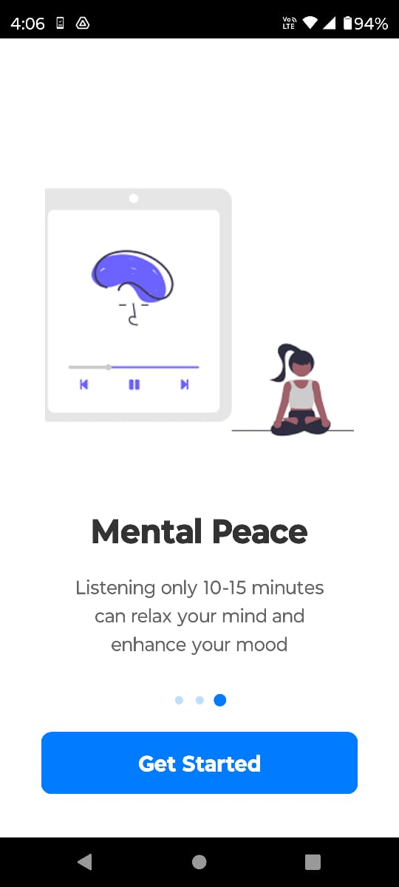
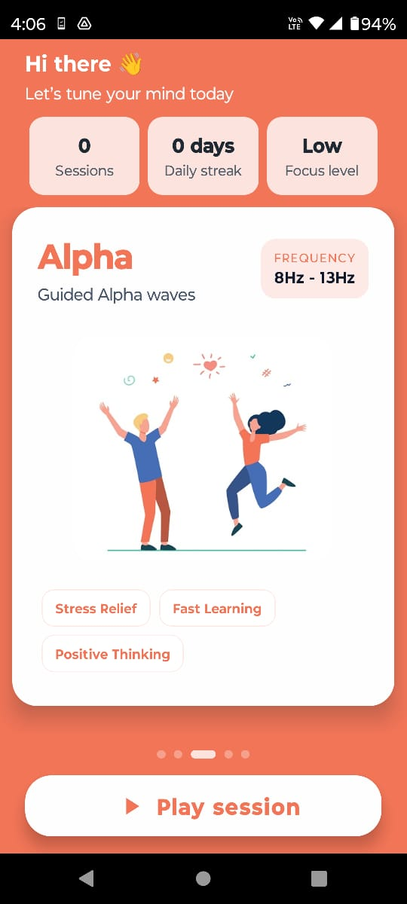
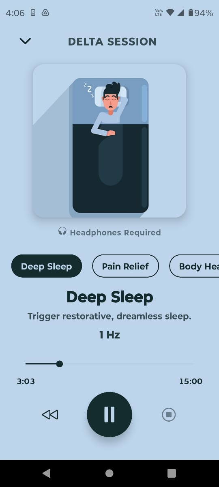

# BrainX 🧠🎧

**BrainX** is a cutting-edge React Native application designed to enhance your mental state—whether you need to focus, sleep, or meditate—using the power of **Binaural Beats**.

Unlike traditional apps that play large, static audio files, BrainX generates pure audio frequencies in real-time using a custom-built Audio Engine.

---

## 🧐 What are Binaural Beats?

Binaural beats are an auditory illusion perceived when two different pure-tone sine waves, both with frequencies lower than 1500 Hz, are presented to a listener dichotically (one through each ear).

For example, if a 440 Hz tone is presented to the right ear and a 444 Hz tone is presented to the left ear, the listener will perceive a third tone (the binaural beat) at a frequency of **4 Hz** (the difference between the two).

Different frequency gaps correspond to different brainwave states:
- **Delta (0.1 - 4Hz):** Deep Sleep, Healing.
- **Theta (4 - 8Hz):** Meditation, Creativity.
- **Alpha (8 - 14Hz):** Relaxation, Focus.
- **Beta (14 - 30Hz):** Alertness, Concentration.
- **Gamma (30Hz+):** Peak Awareness.

---

## 🚀 How is BrainX Different?

Most binaural beat applications on the market simply play pre-recorded **MP3 files**. While this works, it has significant downsides:
1.  **Large App Size:** High-quality audio files are heavy.
2.  **Compression Artifacts:** MP3 compression can distort the pure sine waves needed for effective binaural beats.
3.  **Looping:** You can often hear when the track restarts.

**BrainX is different.**

### ✨ Real-Time Audio Generation
BrainX does **not** use MP3s. Instead, it uses a custom **Audio Engine** (built on the Web Audio API) to generate mathematical sine waves in real-time on your device.

*   **Crystal Clear Audio:** Zero compression. You hear the exact mathematical frequencies.
*   **Tiny App Size:** Since we don't store audio files, the app is incredibly lightweight (~20-25MB).
*   **Infinite Playback:** The audio is generated continuously. No loops, no breaks, just pure focus.
*   **Dynamic Control:** We can adjust frequencies instantly without loading new files.

---

## 📥 Download

You can download the latest Android APK from the **Releases** section of this repository.

> **Note:** The APK size is approximately **100 MB** because it is a **Universal APK** (containing code for all device architectures: ARM, x86, etc.).
>
> If you were to download the specific version for your phone from the Play Store, it would be much smaller (~20-25 MB).
---

## 📸 Screenshots

<p align="center">
  
  
  
</p>

---

## 🛠 Tech Stack

*   **Framework:** React Native 0.79 (New Architecture Enabled)
*   **Language:** TypeScript
*   **Audio:** `react-native-audio-api` (Real-time Oscillators & GainNodes)
*   **Storage:** `react-native-mmkv` (High-performance storage for stats)
*   **Animations:** `react-native-reanimated`
*   **Navigation:** React Navigation v7
*   **Splash Screen:** `react-native-bootsplash`

---

## 🏃‍♂️ How to Run

1.  **Install Dependencies:**
    ```bash
    npm install
    ```

2.  **Run on Android:**
    ```bash
    npm run android
    ```

3.  **Run on iOS:**
    ```bash
    cd ios && pod install && cd ..
    npm run ios
    ```

---

## 📱 Features

*   **Multiple Categories:** Delta, Theta, Alpha, Beta, Gamma.
*   **Session Tracking:** Records your daily listening time.
*   **Daily Streaks:** Keeps you motivated to build a habit.
*   **Background Playback:** Continues playing even when you lock your phone.
*   **Clean UI:** Minimalist design focused on user experience.
